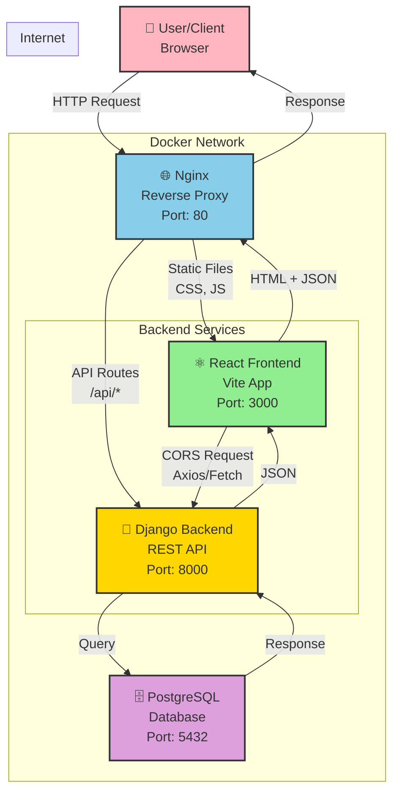

# System Architecture Diagram

## Overview

## Data Flow

### 1. Frontend Request Flow
- User opens browser → `http://localhost`
- Nginx receives request at port 80
- Routes to React static files
- React app loads and displays UI

### 2. API Request Flow
- React component calls backend API: `axios.get('/api/data/')`
- Request goes through Nginx (reverse proxy)
- Nginx routes to Django backend at `http://backend:8000`
- Django processes request and queries PostgreSQL
- Response returns through Nginx to React

### 3. Services Communication
- **Frontend ↔ Backend**: Via Nginx proxy (http://backend:8000)
- **Backend ↔ Database**: Direct connection (db:5432)
- **User ↔ System**: Via Nginx port 80

## Component Details

### Nginx (Reverse Proxy)
- **Port**: 80 (external access)
- **Role**: Route traffic, load balance, serve static files
- **Routes**:
  - `GET /api/*` → Django Backend
  - `GET /admin/*` → Django Admin
  - `GET /*` → React Frontend

### React Frontend
- **Port**: 3000 (internal, accessed via Nginx)
- **Technology**: React 18 + Vite
- **Build**: Multi-stage Docker build (Node + Nginx)
- **Static Serving**: Nginx alpine

### Django Backend
- **Port**: 8000
- **Technology**: Django 4.2 + DRF (Django REST Framework)
- **Server**: Gunicorn WSGI server
- **Database**: PostgreSQL 15.2

### PostgreSQL Database
- **Port**: 5432
- **Technology**: PostgreSQL 15.2
- **Storage**: Docker volume (persistent)
- **Access**: Django ORM via psycopg2-binary

## Docker Network